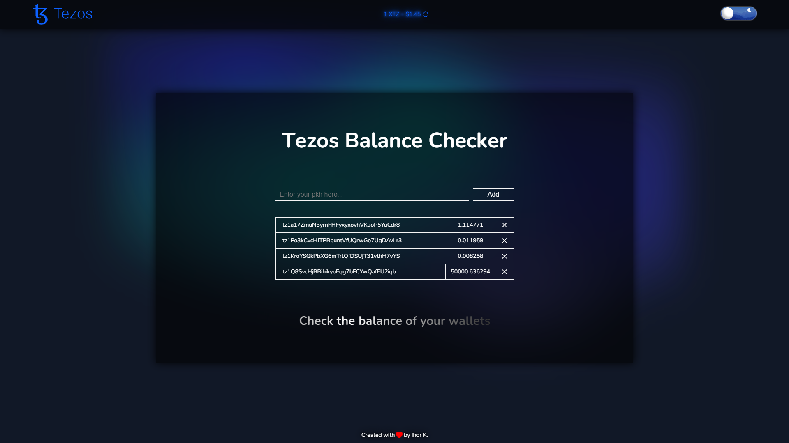

# 💱 Check the balance of your xtz wallets

## ⭐ Demo

The demo website app link - [https://tezos-balance-checker.vercel.app/](https://tezos-balance-checker.vercel.app/)

## ▶️ Installation

To run application from source code locally:

Clone repository

```
git clone https://github.com/Overbist/Tezos-Balance-Checker.git && cd Tezos-Balance-Checker
```

Install dependencies

```
yarn
```

To start app run

```
# Runs the app in the development mode.
yarn start
Open http://localhost:3000 to view it in the browser.
```
